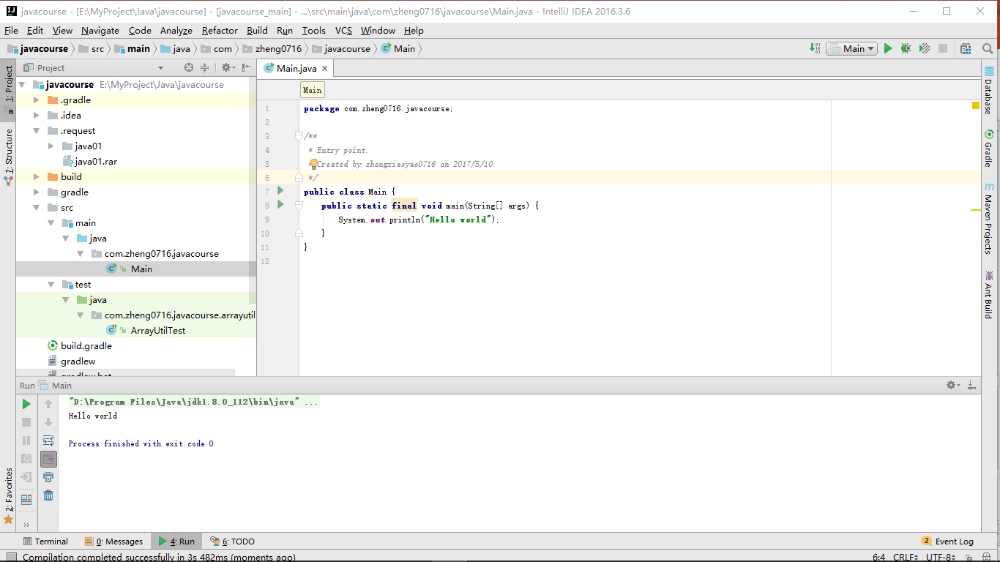
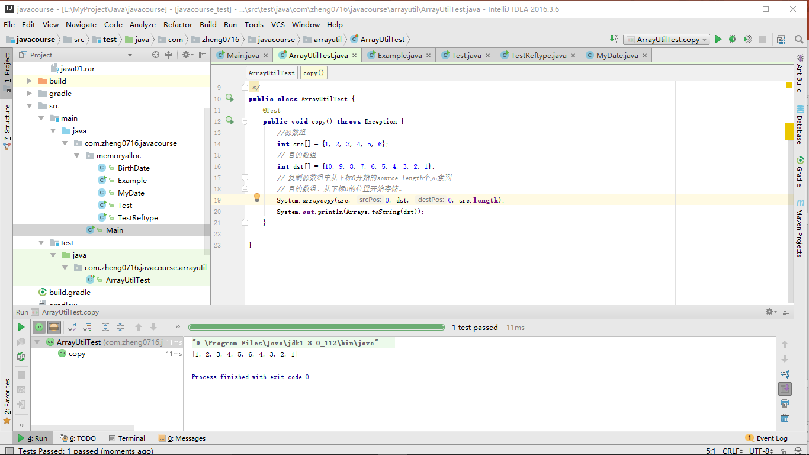
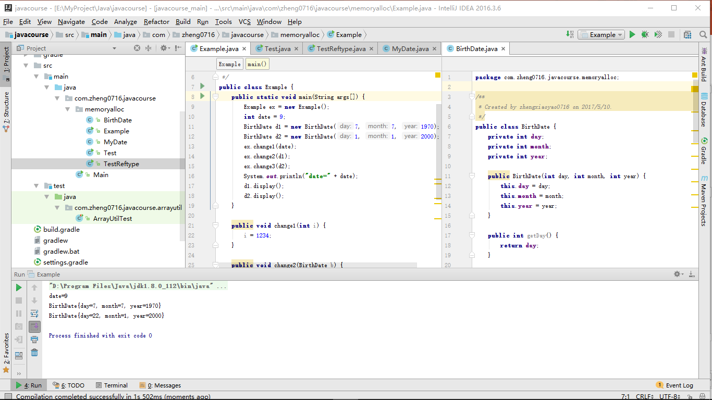
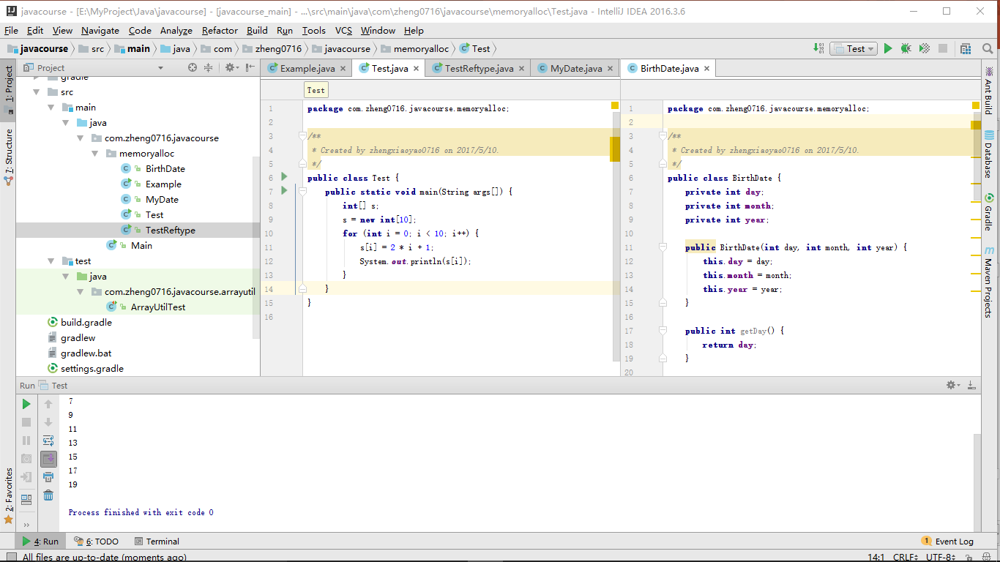
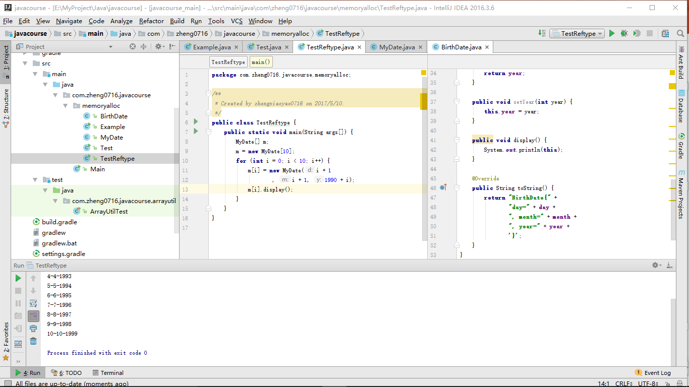
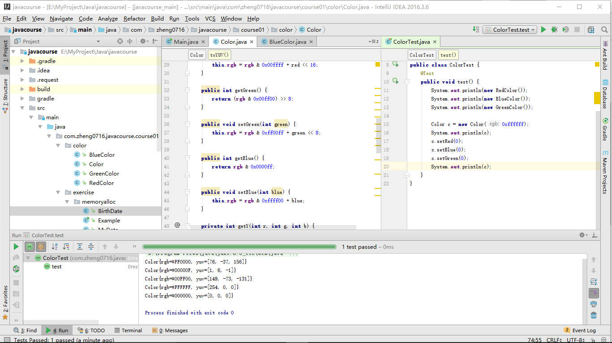

# Java程序设计
## 第一次实验报告

***
## 一、 练习

### Hello World
没啥可说的，截图：




### copyarray 复制数组
同样没啥可说的，截图：




### memory alloc 内存分配

值传递：



基本数组：



引用数组：




***
## 二、小作业

### rgb值的表示
一个int就够了，6位16进制数，这也是rgb的通常表示。通过位运算对具体某一项修改赋值。

### red、green、blue属性的表示
并不存在真正的3个变量，而是用3对getter|setter方法，分装作为属性。

### rgb <=> red|green|blue：
``` java
int red = rgb >> 16;
int green = (rgb & 0x00ff00) >> 8;
int blue = rgb & 0x0000ff;
int rgb = red << 16 + green << 8 + blue;
```

### rgb to yuv
yuv具体算法不是这里的重点，所以没仔细优化
``` java
int y = (r * 1224 + g * 2404 + b * 467) >> 12;
int u = (int) (-0.147 * r - 0.289 * g + 0.436 * b);  // 未优化
int v = (int) (0.615 * r - 0.515 * g - 0.100 * b);  // 未优化
```

### 测试截图

