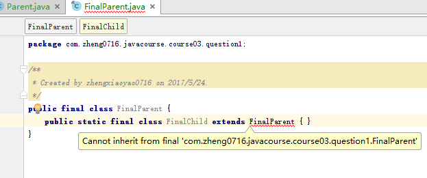
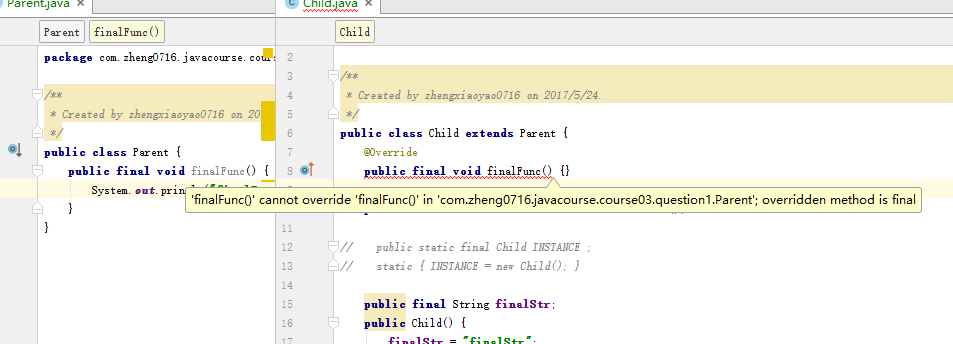
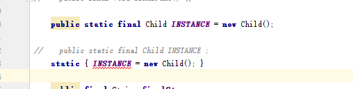
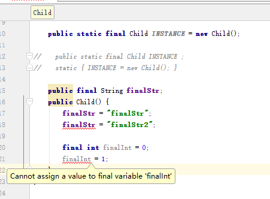
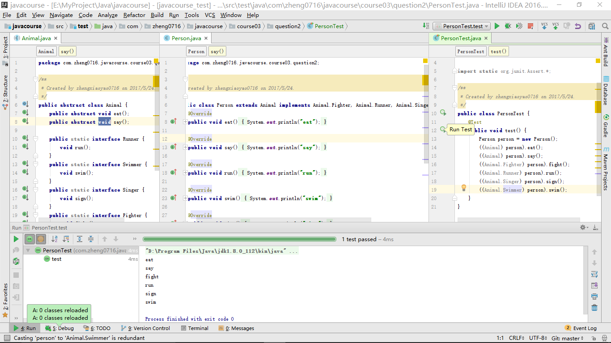
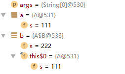
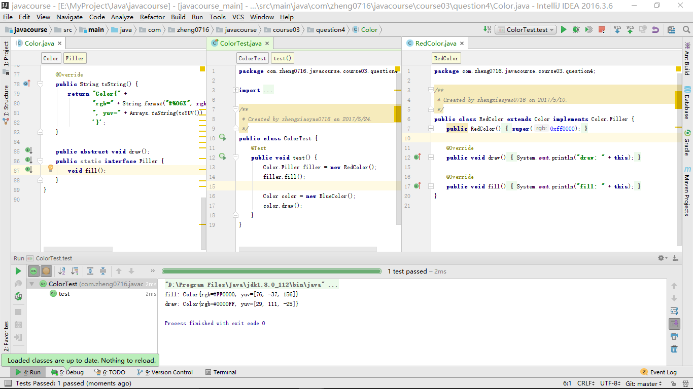

# Java程序设计
## 第三次实验报告

***
### 题目1：设计一个程序，验证如下说法：

    final标记的类不能被继承。
    final标记的方法不能被子类重写。
    final标记的变量(成员变量或局部变量)即成为常量，只能赋值一次

### 题目2：参考如下程序，设计一个类Person，重新设计抽象类Animal，实现个抽象方法，eat()和say()，同时实现四个接口：Runner、Swimmer、Singer、Fighter，

### 题目3： 编写代码，画出每条语句执行后，堆栈的内存分布图。

### 题目4：修改Color、Blue、Green和Red类，用抽象类实现draw函数，用接口实现fill函数。

