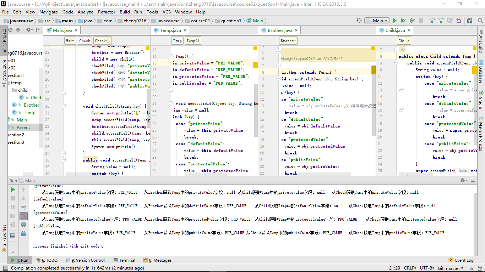
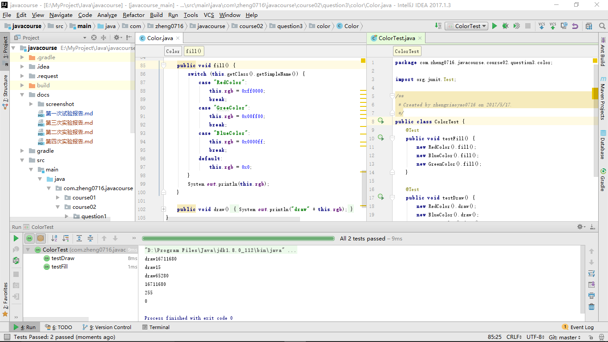

# Java程序设计
## 第二次实验报告

***
### 题目1：设计一个程序，可以验证下面表格的正确性。

### 题目2：设计一个程序，说明运行时多态和编译时多态的区别与联系。

`题目1` 即体现了编译时的多态，通过方法的重载和覆盖，实现编译时根据具体的类、参数寻找不同的方法。

`题目3` 即体现了运行时多态，this的具体指向在运行时才寻找，同一方法对不同的类的实例，具有不同的this指向和执行效果。

### 题目3：在上一节课Color类、Blue类、Red类和Green类的基础上， 使用运行多态的原理，为Blue、Red和Green类设计Fill和Draw方法。

